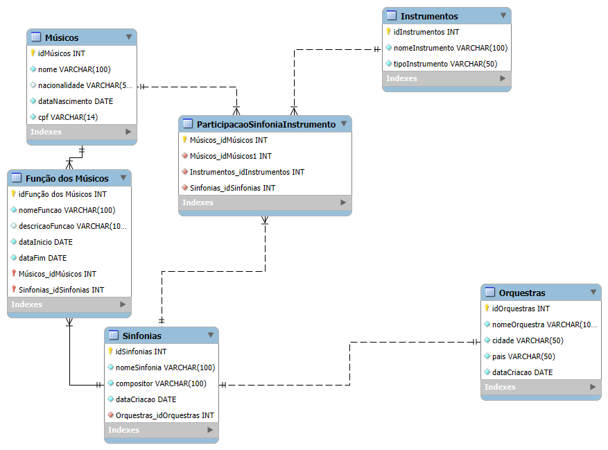

# 🎼 Escola de Música - Banco de Dados

Este repositório contém o projeto de banco de dados para a Escola de Música, destinado a facilitar a gestão de orquestras, músicos, instrumentos e apresentações. O objetivo é oferecer uma solução eficiente para organizar e controlar a participação dos músicos em diferentes eventos, bem como a distribuição dos instrumentos e a execução de sinfonias.

---

## 📄 Descrição do Projeto
A proposta deste banco de dados é garantir a administração integrada de todos os elementos essenciais na rotina da escola, incluindo:

- **Músicos**: Registro de informações pessoais e instrumentais.
- **Instrumentos**: Controle de tipos e disponibilidade.
- **Apresentações**: Monitoramento das sinfonias executadas e controle de participação.
- **Sinfonias**: Identificação das obras executadas durante cada apresentação.

---

## 🎨 Modelagem do Banco de Dados
### MER (Modelo Entidade-Relacionamento)


### MR (Modelo Relacional)


---

## 🗄️ Scripts SQL
O projeto inclui scripts SQL organizados para cada funcionalidade essencial do banco de dados:

1. **Criação (DDL)**: Scripts contendo `CREATE` para criação de tabelas e relacionamentos.
2. **Alteração (DDL)**: Mínimo de 10 scripts para alterações nas estruturas das tabelas.
3. **Destruição (DDL)**: Scripts para deletar views e dependências.
4. **Inserção de Dados (DML)**: Cada tabela contém pelo menos 10 registros.
5. **Atualização e Exclusão (DML)**: No mínimo 20 scripts para atualizar ou excluir dados.
6. **Consultas e Relatórios (DQL)**: Scripts com `JOIN` e subqueries, com no mínimo 20 consultas.
7. **Views**: Criação de pelo menos 10 views para relatórios principais.

---

## 🚀 Como Executar
1. Clone o repositório:
   ```bash
   git clone https://github.com/Miguel48569/Escola-de-M-sica.git
